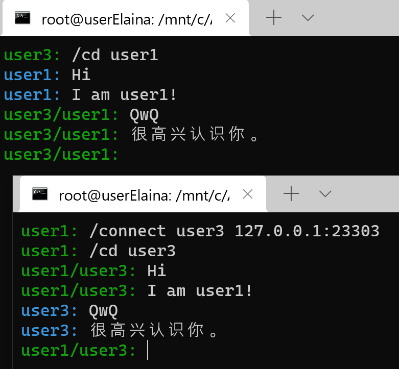

# MySSH & TCP.Chat

### 环境依赖
`python>=3.7`;

知名 python module `rsa`;

本地 python module `userelaina` `rsap2p`.

上述两包已分别开源于 [Git](https://github.com/userElaina/sugar)[Hub](https://github.com/userElaina/rsap2p),
同时也在此目录中给出.

### MySSH
**MySSH** 为基于TCP协议实现的~~fake~~ssh服务端和客户端.

服务端运行 `MySSHServer` 后, 客户端通过 `MySSH ip port name` 连接.

### TCP.Chat
**TCP.Chat** 为基于TCP协议实现的去中心化E2EE通信软件.

目前只有CUI.

#### 指令

##### 连接
`/connect username IP:PORT`

##### 给某人发送消息
`/cd username`
之后发送的所有非 `/` 开头的内容均会被发送给此人.

##### 查看当前已连接
`/ls`

##### 关闭连接
`/close username`

#### 效果图

### 其他
`randppks.py` 用于生成密钥对.

`test1.sh` 用于测试缓冲问题.